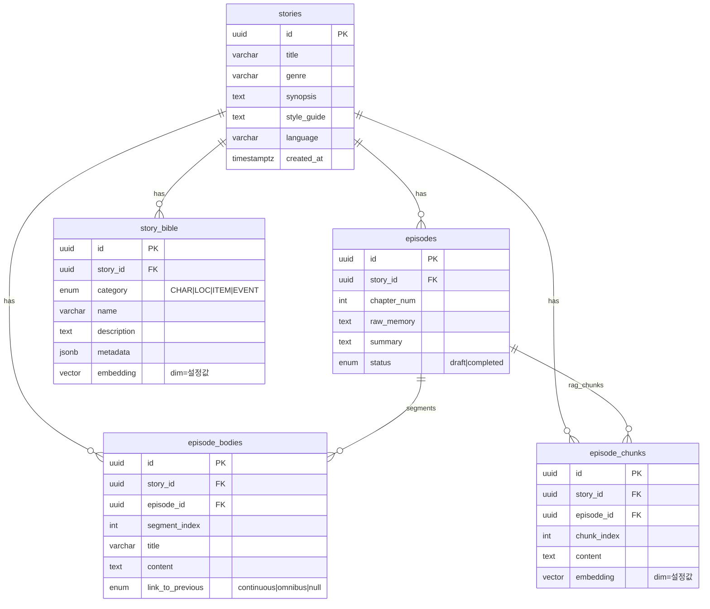

# 데이터베이스 ERD (novel-writing-agent)

SQLAlchemy 모델(`backend/app/models.py`) 및 Alembic(`001_initial.py`, `002_pg_trgm_search.py`, `003_vector_dim_1024_bge_m3.py`) 기준입니다.

- **PostgreSQL** + **pgvector** 확장(`embedding` 컬럼).
- **본문 저장**: 챕터(`episodes`)의 실제 소설 텍스트는 **`episode_bodies` 행들**만 사용합니다. API JSON의 `ai_content`는 DB 컬럼이 아니라 `bodies`를 합친 **계산 속성**입니다.
- **임베딩 차원**: `Vector` 차원은 `.env`의 `EMBEDDING_DIMENSION`과 일치해야 합니다(기본 **1024**, Ollama `bge-m3`).

---

## 관계 다이어그램 (Mermaid)

GitHub·GitLab·VS Code(Mermaid 미리보기) 등에서 렌더링할 수 있습니다.

---

## 관계·삭제 규칙 요약

| 자식 테이블       | 부모            | FK              | `ON DELETE` |
|------------------|-----------------|-----------------|-------------|
| `episodes`       | `stories`       | `story_id`      | `CASCADE`   |
| `episode_bodies` | `stories`       | `story_id`      | `CASCADE`   |
| `episode_bodies` | `episodes`      | `episode_id`    | `CASCADE`   |
| `story_bible`    | `stories`       | `story_id`      | `CASCADE`   |
| `episode_chunks` | `stories`       | `story_id`      | `CASCADE`   |
| `episode_chunks` | `episodes`      | `episode_id`    | `CASCADE`   |

`episode_bodies`는 `story_id`와 `episode_id`를 모두 갖습니다(스토리 단위 조회·정합성용).

---

## PostgreSQL ENUM 타입

| 타입명            | 값                                      |
|-------------------|-----------------------------------------|
| `episodestatus`   | `draft`, `completed`                    |
| `bodysegmentlink` | `continuous`, `omnibus`                 |
| `biblecategory`   | `CHAR`, `LOC`, `ITEM`, `EVENT`          |

---

## 인덱스

- `episode_bodies`: `(episode_id, segment_index)` — `ix_episode_bodies_episode_segment`
