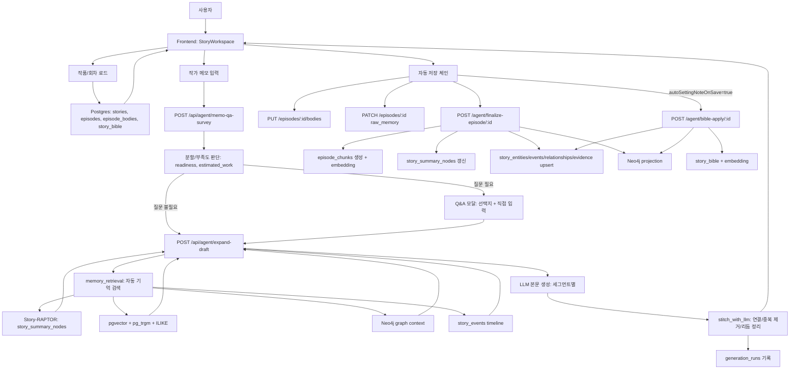
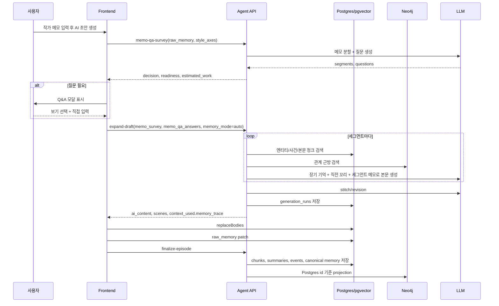
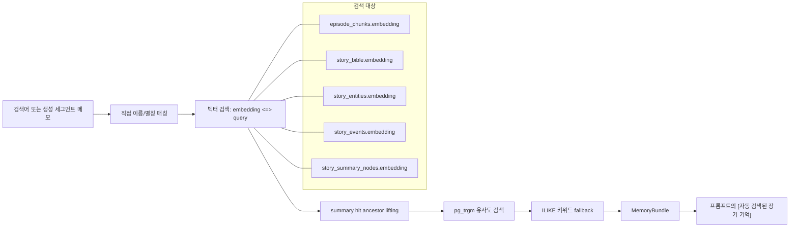
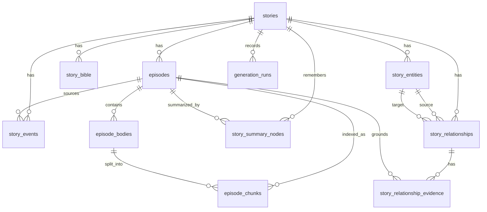
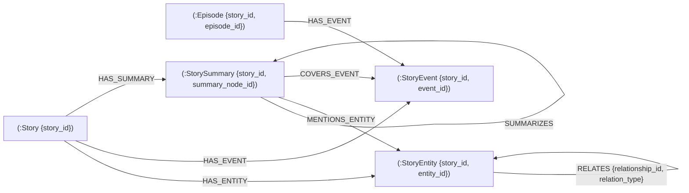

# 장편 소설 도우미 서비스 흐름도와 DB 사전

이 문서는 현재 코드 기준의 서비스 흐름과 저장소 구조를 정리한다. 인증/사용자 관리는 제외한다.

## 1. 저장소 역할

| 저장소 | 역할 | 원본 여부 | 주요 사용처 |
|---|---|---:|---|
| Postgres | 작품, 회차, 본문 블록, 설정 노트, canonical 장편 기억의 원본 | 원본 | 생성, 저장, RAG, 검수, 동기화 |
| pgvector | Postgres 안의 벡터 컬럼 | 원본의 검색 인덱스 | 의미 기반 RAG 검색 |
| pg_trgm | Postgres 문자열 유사도 인덱스 | 보조 검색 인덱스 | 오타/부분 검색 fallback |
| Neo4j | Postgres canonical memory를 관계 탐색/3D 시각화용으로 투영 | 투영 | 그래프 검색, 그래프 컨텍스트, 3D 관계 지도 |

## 2. 전체 서비스 흐름



## 3. 생성 세부 흐름



## 4. RAG/검색 흐름



## 5. Postgres ER 구조



## 6. Postgres 테이블 컬럼 사전

### `stories`

작품 단위의 최상위 원본.

| 컬럼 | 타입/값 | 의미 |
|---|---|---|
| `id` | UUID | 작품 id |
| `title` | string | 작품 제목 |
| `genre` | string | 장르 |
| `synopsis` | text, nullable | 작품 시놉시스 |
| `world_setting` | text, nullable | 세계관, 대전제, 핵심 갈등, 배경 규칙 |
| `global_rules` | JSONB, nullable | 전역 규칙. 예: 금기, 톤, 설정 제한 |
| `style_guide` | text, nullable | 문체 지침 |
| `language` | string, 기본 `KO` | 생성 언어 |
| `created_at` | timestamptz | 생성 시각 |
| `work_summary` | text, nullable | 회차 요약들을 압축한 작품 전체 요약 |

### `episodes`

회차/챕터 단위 원본. 실제 본문은 `episode_bodies`에 저장되고 `ai_content`는 저장 컬럼이 아니라 합본 property다.

| 컬럼 | 타입/값 | 의미 |
|---|---|---|
| `id` | UUID | 회차 id |
| `story_id` | UUID FK | 소속 작품 |
| `chapter_num` | integer | 회차 번호. `story_id + chapter_num` 유니크 |
| `raw_memory` | text, nullable | 사용자가 입력한 이번 화 작가 메모 |
| `summary` | text, nullable | finalize 후 생성되는 회차 요약 |
| `chapter_events` | JSONB, nullable | finalize가 추출한 사건 목록 JSON |
| `status` | enum `draft`, `completed` | 회차 상태 |
| `meta_tags` | JSONB, nullable | 챕터 검수 태그. 예: `pov`, `tense`, `omnibus`, `time_jump`, `allow_discontinuity` |

### `episode_bodies`

회차 안의 본문 블록. 긴 메모가 여러 세그먼트로 나뉘면 여러 행으로 저장된다.

| 컬럼 | 타입/값 | 의미 |
|---|---|---|
| `id` | UUID | 본문 블록 id |
| `story_id` | UUID FK | 소속 작품 |
| `episode_id` | UUID FK | 소속 회차 |
| `segment_index` | integer | 회차 안 블록 순서 |
| `title` | string, nullable | 블록 소제목 |
| `content` | text | 실제 원고 본문 |
| `body_summary` | text, nullable | 블록 단위 요약. finalize에서 갱신 |
| `link_to_previous` | enum `continuous`, `omnibus`, null | 이전 블록과의 연결 방식. 첫 블록은 null |
| `parent_id` | UUID FK, nullable | 파생/재생성 블록의 원본 블록 id |
| `meta_tags` | JSONB, nullable | 세그먼트 메타. 예: `memo_segment_id`, `memo_segment_label`, `memo_segment_order`, `scene_plan_id`, `beat`, `pov`, `tension`, `source` |

### `story_bible`

사용자에게 보이는 설정 노트. canonical memory의 원본은 아니지만 생성 컨텍스트와 수동/자동 설정 관리에 사용된다.

| 컬럼 | 타입/값 | 의미 |
|---|---|---|
| `id` | UUID | 설정 항목 id |
| `story_id` | UUID FK | 소속 작품 |
| `category` | enum `CHAR`, `LOC`, `ITEM`, `EVENT` | 설정 항목 종류 |
| `name` | string | 표준 이름 |
| `description` | text, nullable | 설명 |
| `metadata` | JSONB, nullable | 별칭, 중요도, 상태 등 부가 정보 |
| `embedding` | vector | 설정 항목 RAG 검색용 벡터 |

### `episode_chunks`

RAG 검색용 본문 청크. finalize 때 기존 회차 청크를 지우고 현재 본문 기준으로 다시 만든다.

| 컬럼 | 타입/값 | 의미 |
|---|---|---|
| `id` | UUID | 청크 id |
| `story_id` | UUID FK | 소속 작품 |
| `episode_id` | UUID FK | 소속 회차 |
| `chunk_index` | integer | 회차 안 청크 순서 |
| `content` | text | 검색 대상 본문 조각 |
| `category` | string, nullable | 자동 분류. 주로 `character`, `situation`, `event` |
| `chunk_meta` | JSONB, nullable | `segment_index`, `paragraph_index`, `part_index`, `color_tag`, `parent_event_id`, `parent_event_title` 등 |
| `embedding` | vector | 본문 청크 의미 검색용 벡터 |

### `story_entities`

장편 기억의 canonical 엔티티 원본. 인물/장소/조직/물건/상황 등을 정규화해서 저장한다.

| 컬럼 | 타입/값 | 의미 |
|---|---|---|
| `id` | UUID | canonical 엔티티 id |
| `story_id` | UUID FK | 소속 작품 |
| `entity_type` | string | `CHAR`, `LOC`, `ITEM`, `EVENT`, `ORG`, `SITUATION` 등 |
| `name` | string | 표시 이름 |
| `normalized_name` | string | 중복 병합용 정규화 이름 |
| `aliases` | JSONB array, nullable | 별칭 목록 |
| `description` | text, nullable | 현재까지 파악된 설명 |
| `status` | string | 상태. 예: `unknown`, `alive`, `dead`, `active` |
| `importance` | integer 1-5 | 중요도 |
| `first_chapter_num` | integer, nullable | 첫 등장 회차 |
| `last_chapter_num` | integer, nullable | 마지막 근거 회차 |
| `embedding` | vector | 엔티티 의미 검색용 벡터 |
| `metadata` | JSONB, nullable | 출처 힌트, 원본 정보 등 |
| `created_at` | timestamptz | 생성 시각 |
| `updated_at` | timestamptz | 갱신 시각 |

유니크 기준: `story_id + entity_type + normalized_name`.

### `story_events`

작품 전체 타임라인의 canonical 사건 원본.

| 컬럼 | 타입/값 | 의미 |
|---|---|---|
| `id` | UUID | 사건 id |
| `story_id` | UUID FK | 소속 작품 |
| `title` | string | 사건 제목 |
| `normalized_title` | string | 중복 병합용 정규화 제목 |
| `summary` | text, nullable | 사건 요약 |
| `cause` | text, nullable | 원인 |
| `effect` | text, nullable | 결과/영향 |
| `chapter_num` | integer, nullable | 발생 회차 |
| `event_order` | integer, nullable | 회차 안 사건 순서 |
| `location_entity_id` | UUID FK, nullable | 발생 장소 엔티티 |
| `source_episode_id` | UUID FK, nullable | 근거 회차 |
| `source_body_id` | UUID FK, nullable | 근거 본문 블록 |
| `source_chunk_id` | UUID FK, nullable | 근거 청크 |
| `importance` | integer 1-5 | 중요도 |
| `embedding` | vector | 사건 의미 검색용 벡터 |
| `metadata` | JSONB, nullable | 원본 이벤트 JSON 등 |
| `created_at` | timestamptz | 생성 시각 |
| `updated_at` | timestamptz | 갱신 시각 |

### `story_relationships`

canonical 엔티티 간 현재 관계.

| 컬럼 | 타입/값 | 의미 |
|---|---|---|
| `id` | UUID | 관계 id. Neo4j `relationship_id`로 투영 |
| `story_id` | UUID FK | 소속 작품 |
| `source_entity_id` | UUID FK | 관계 시작 엔티티 |
| `target_entity_id` | UUID FK | 관계 대상 엔티티 |
| `relation_type` | string | 관계 타입. 예: `ALLY_OF`, `ENEMY_OF`, `FAMILY_OF`, `LOVES`, `BELONGS_TO`, `LOCATED_IN`, `PARTICIPATED_IN`, `CAUSES`, `AFTER`, `BEFORE`, `DIED_IN`, `TRIGGERED_BY`, `LEADS_TO`, `INVOLVED_IN` |
| `current_state` | string, nullable | 현재 관계 상태/맥락 |
| `confidence` | float 0-1, nullable | 추출 신뢰도 |
| `first_chapter_num` | integer, nullable | 첫 근거 회차 |
| `last_chapter_num` | integer, nullable | 최신 근거 회차 |
| `metadata` | JSONB, nullable | 추가 관계 메타 |
| `created_at` | timestamptz | 생성 시각 |
| `updated_at` | timestamptz | 갱신 시각 |

유니크 기준: `story_id + source_entity_id + target_entity_id + relation_type`.

### `story_relationship_evidence`

관계 판단의 근거 이력. 관계 상태는 `story_relationships`에 있고, 근거 문단은 여기에 누적된다.

| 컬럼 | 타입/값 | 의미 |
|---|---|---|
| `id` | UUID | 근거 id |
| `story_id` | UUID FK | 소속 작품 |
| `relationship_id` | UUID FK | 대상 관계 |
| `episode_id` | UUID FK, nullable | 근거 회차 |
| `body_id` | UUID FK, nullable | 근거 본문 블록 |
| `chunk_id` | UUID FK, nullable | 근거 청크 |
| `paragraph_index` | integer, nullable | 근거 문단 인덱스 |
| `evidence_excerpt` | text, nullable | 짧은 원문 근거 |
| `confidence` | float 0-1, nullable | 해당 근거의 신뢰도 |
| `origin_kind` | string | 출처 종류. 예: `episode`, `manual_graph_sync`, `bible` |
| `created_at` | timestamptz | 생성 시각 |

### `generation_runs`

생성 요청마다 어떤 세그먼트와 기억이 쓰였는지 남기는 디버깅 로그.

| 컬럼 | 타입/값 | 의미 |
|---|---|---|
| `id` | UUID | 생성 실행 id |
| `story_id` | UUID FK | 소속 작품 |
| `episode_id` | UUID FK, nullable | 대상 회차 |
| `run_mode` | string | `single_pass`, `multi_step`, `orchestrated_draft`, `orchestrated_draft_memo_qa`, `scene_plan` 등 |
| `memory_mode` | string | `auto` 또는 `off` |
| `segments` | JSONB, nullable | 실제 생성에 사용한 세그먼트 배열 |
| `memory_trace` | JSONB, nullable | 세그먼트별 자동 검색 결과 id/발췌 |
| `revision_payload` | JSONB, nullable | stitch 결과, source_segment_count, sync_trace 등 |
| `status` | string | 실행 상태. 기본 `completed` |
| `created_at` | timestamptz | 생성 실행 시각 |

### `story_summary_nodes`

Story-RAPTOR 요약 트리의 검색 가능한 기억 노드. `foundation → body_group → chapter → arc → volume → work` 흐름을 저장한다.

| 컬럼 | 타입/값 | 의미 |
|---|---|---|
| `id` | UUID | 요약 노드 id. Neo4j `summary_node_id`로 투영 |
| `story_id` | UUID FK | 소속 작품 |
| `episode_id` | UUID FK, nullable | 특정 회차에 붙는 `body_group`, `chapter` 노드의 회차 |
| `node_key` | string | idempotent upsert 키. 예: `foundation`, `chapter:12`, `arc:1-8` |
| `level` | string | `foundation`, `body_group`, `chapter`, `arc`, `volume`, `work` |
| `parent_id` | UUID self FK, nullable | 상위 요약 노드 |
| `root_id` | UUID self FK, nullable | 루트 요약 노드 |
| `depth` | integer | 트리 깊이 |
| `path` | JSONB | 상위에서 현재까지의 `node_key` 경로 |
| `ordinal` | integer, nullable | 같은 level 안의 순서 |
| `chapter_start`, `chapter_end` | integer, nullable | 이 요약이 대표하는 회차 범위 |
| `source_body_ids` | JSONB | 이 노드가 대표하는 본문 블록 id 목록 |
| `source_episode_ids` | JSONB | 이 노드가 대표하는 회차 id 목록 |
| `entity_ids` | JSONB | 이 노드가 언급/대표하는 canonical entity id 목록 |
| `event_ids` | JSONB | 이 노드가 포함하는 canonical event id 목록 |
| `relationship_ids` | JSONB | 이 노드가 참조하는 canonical relationship id 목록 |
| `summary` | text | 검색·프롬프트 주입용 요약문 |
| `keywords` | JSONB | 랭킹 보조 키워드 |
| `embedding` | vector | 요약 노드 의미 검색 벡터 |
| `token_count` | integer | 요약문 토큰 근사치 |
| `coverage_score` | float, nullable | 하위 내용을 얼마나 대표하는지에 대한 내부 점수 |
| `stale` | boolean | 원문 수정 뒤 재빌드 전이면 true |
| `metadata` | JSONB | origin, group_size 등 보조 정보 |
| `created_at`, `updated_at` | timestamptz | 생성/수정 시각 |

## 7. 벡터/RAG 컬럼과 의미

| 테이블.컬럼 | 벡터 대상 텍스트 | 의미 |
|---|---|---|
| `story_bible.embedding` | `[category] name + description` | 설정 노트 의미 검색 |
| `episode_chunks.embedding` | 본문 단락/청크 content | 과거 본문 의미 검색 |
| `story_entities.embedding` | `[entity_type] name + description` | 인물/장소/조직/물건 의미 검색 |
| `story_events.embedding` | `title + summary + cause/effect` | 사건 타임라인 의미 검색 |
| `story_summary_nodes.embedding` | `[level] summary` | 상위/하위 요약 트리 의미 검색 |

검색 순서:

1. 임베딩이 켜져 있으면 vector cosine 검색
2. 실패하거나 결과가 없으면 `pg_trgm` 유사도 검색
3. 마지막으로 `ILIKE` 부분 문자열 검색

관련 인덱스:

| 인덱스 | 의미 |
|---|---|
| `ix_episode_chunks_story_episode_category` | 회차/카테고리별 청크 조회 |
| `ix_episode_chunks_content_trgm` | 본문 청크 오타/부분 유사도 검색 |
| `ix_story_bible_name_trgm` | 설정 노트 이름 유사도 검색 |
| `ix_story_bible_description_trgm` | 설정 노트 설명 유사도 검색 |
| `ix_story_entities_embedding_hnsw` | 엔티티 벡터 검색 |
| `ix_story_events_embedding_hnsw` | 사건 벡터 검색 |
| `ix_story_summary_nodes_embedding_hnsw` | 요약 트리 벡터 검색 |
| `ix_story_summary_nodes_summary_trgm` | 요약 트리 문자열 유사도 검색 |

## 8. Neo4j 투영 구조

Postgres가 원본이고 Neo4j는 시각화/관계 탐색용 projection이다.



### Neo4j 노드 속성

| 라벨 | 속성 | 의미 |
|---|---|---|
| `Story` | `story_id` | 작품 id |
| `Episode` | `story_id`, `episode_id`, `updated_at` | 회차 노드 |
| `StoryEntity` | `story_id`, `entity_id`, `name`, `entity_type`, `status`, `importance`, `description`, `created_at`, `updated_at` | Postgres `story_entities` 투영 |
| `StoryEvent` | `story_id`, `event_id`, `title`, `summary`, `chapter_num`, `event_order`, `importance`, `created_at`, `updated_at` | Postgres `story_events` 투영 |
| `StorySummary` | `story_id`, `summary_node_id`, `node_key`, `level`, `summary`, `chapter_start`, `chapter_end`, `created_at`, `updated_at` | Postgres `story_summary_nodes` 투영 |
| `Entity` | `story_id`, `name`, `node_type`, `status`, `importance`, `origin_hint`, `last_origin_kind`, `last_origin_id`, `created_at`, `updated_at` | 과거 직접 그래프 추출 경로 호환용 fallback 노드 |

### Neo4j 관계 속성

| 관계 | 속성 | 의미 |
|---|---|---|
| `HAS_ENTITY` | 없음 | 작품이 엔티티를 포함 |
| `HAS_EVENT` | 없음 | 작품/회차가 사건을 포함 |
| `RELATES` canonical | `story_id`, `relationship_id`, `relation_type`, `current_state`, `context`, `confidence`, `created_at`, `updated_at` | Postgres `story_relationships` 투영 |
| `RELATES` fallback | `story_id`, `relation_type`, `context`, `confidence`, `last_origin_kind`, `last_origin_id`, `created_at`, `updated_at` | 과거 `Entity` 그래프 호환용 |
| `SUMMARIZES` | `story_id` | 상위 요약이 하위 요약을 대표 |
| `MENTIONS_ENTITY` | `story_id` | 요약 노드가 인물/장소/조직 등 엔티티를 언급 |
| `COVERS_EVENT` | `story_id` | 요약 노드가 사건을 포함 |

## 9. 주요 API와 저장 영향

| API | 입력 | 쓰는 DB | 결과 |
|---|---|---|---|
| `POST /api/agent/memo-qa-survey` | `episode_id`, `raw_memory`, `style_axes` | 없음 | 분할, 질문, readiness, estimated_work |
| `POST /api/agent/expand-draft` | `memo_survey`, `memo_qa_answers`, `memory_mode` | `generation_runs` | 초안, scenes, memory_trace |
| `PUT /api/stories/:sid/episodes/:eid/bodies` | 본문 블록 배열 | `episode_bodies` | 회차 본문 교체 |
| `PATCH /api/stories/:sid/episodes/:eid` | `raw_memory`, `meta_tags` 등 | `episodes` | 회차 메타 갱신 |
| `POST /api/agent/finalize-episode/:eid` | 저장된 본문 | `episode_bodies`, `episodes`, `episode_chunks`, `story_entities`, `story_events`, `story_relationships`, `story_relationship_evidence`, Neo4j | 요약, RAG 청크, canonical memory, 그래프 투영 |
| `POST /api/agent/summary-tree/rebuild/:story_id` | 작품 id | `story_summary_nodes`, Neo4j | 요약 트리 전체 재빌드 |
| `GET /api/agent/summary-tree/:story_id` | 작품 id | 조회만 | 요약 트리 디버깅 조회 |
| `POST /api/agent/bible-apply/:eid` | 저장된 본문 | `story_bible`, `story_entities`, Neo4j | 설정 노트와 엔티티 투영 |
| `POST /api/agent/rag-search` | `story_id`, `query` | 조회만 | RAG 검색 결과 |
| `GET /api/agent/graph/subgraph/:story_id` | `center`, `depth`, `limit`, `node_types` | Neo4j 조회 | 3D 그래프 노드/링크 |
| `POST /api/agent/review/episode/:eid` | 저장된 본문 | 조회 중심 | 검수 이슈, POV/시제, Top-K 근거 |

## 10. 생성 후 저장되는 값의 예

긴 메모가 세 조각으로 분할되면 `episode_bodies.meta_tags`는 대략 다음처럼 들어간다.

```json
{
  "memo_orchestrated": true,
  "memo_qa": true,
  "memo_segment_id": "m2",
  "memo_segment_label": "하준의 침묵",
  "memo_segment_order": 2,
  "source": "memo_survey"
}
```

`generation_runs.memory_trace`는 다음처럼 자동 검색 근거를 남긴다.

```json
[
  {
    "query": "하준이 카드의 의미를 알고도 말하지 않는다.",
    "entities": [{"id": "...", "name": "하준", "type": "CHAR"}],
    "relationships": [{"id": "...", "source": "서윤", "target": "하준"}],
    "events": [{"id": "...", "title": "지민 실종"}],
    "excerpts": [{"chapter_num": 1, "snippet": "짧은 본문 발췌"}],
    "warnings": []
  }
]
```
